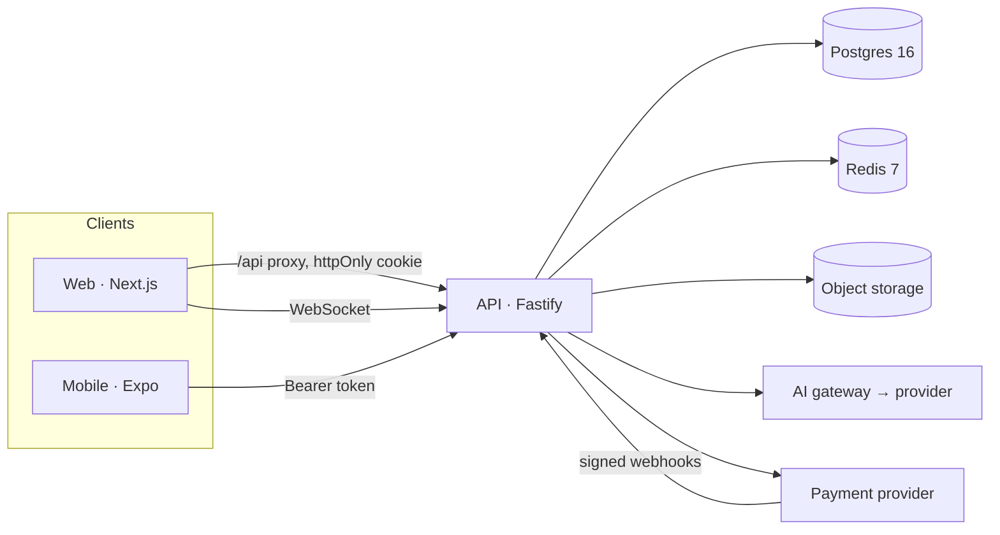

# Architecture overview

## Principles

- **One API, many clients.** Web, mobile and admin use the same endpoints through `@yapilapi/api-client`.
- **The server decides.** Authentication, authorization and validation run on every protected endpoint. Visibility rules live in SQL predicates (`apps/api/src/lib/visibility.ts`) that feed, profile, search and AI context all share.
- **Modules by domain.** Each file in `apps/api/src/modules/` owns one domain's routes and rules. Cross-cutting services (audit, notifications, analytics, flags) live in `apps/api/src/lib/services.ts`.
- **Adapters at the edges.** Email, storage, payments and AI providers are interfaces with development implementations, so a missing external account never blocks the rest.
- **Degrade gracefully.** Redis outages fall back to in-process rate limiting and realtime; AI failures return errors only for AI features; analytics writes never fail a request.

## Request pipeline

1. `onRequest`: resolve the session from the cookie or Bearer token.
2. `preHandler`: rate limit (per user, else per IP; Redis-backed), then route-level `requireAuth` / `requireRole`.
3. Handler: `parse(schema, input)` with shared zod schemas, business rules, database work in transactions.
4. `onSend`: security headers and `x-request-id`. `onResponse`: metrics.
5. Errors map to `{ error: { code, message, details, requestId } }`.

## Data

Postgres is the source of truth (see `packages/database/migrations/`). Counters (likes, comments, members) are denormalized and updated in the same transaction as the write. Full-text search uses generated `tsvector` columns with GIN indexes. Soft deletion (`deleted_at`) is used for user content so moderation and audit stay consistent.

## Realtime

The API keeps WebSocket connections per user. With Redis configured, events are published to one channel and every instance delivers to its own sockets, so the API scales horizontally. Events: `message.created`, `message.deleted`, `message.reaction`, `typing`, `conversation.created`, `plan.created`, `notification.created`.

## AI

`AiGateway` runs every request through: permission check → context loading (only data the requester can already see) → provider → output safety → audit log (task, scopes, status, latency; never content). Providers implement one `complete()` method. The Claude adapter uses the official SDK; the dev provider is deterministic and offline and is labelled as such in responses.

## Feature flags

`feature_flags` rows override defaults in `packages/shared/src/flags.ts`. Admins toggle them at `/admin`; every change is audited. Initial flags: LIVE, COMMERCE, AI_TRANSLATION, MEMORY, NOW, MINI_APPS, PLAY, REAL, REAL_TOGETHER.

See also: [decisions](decisions/), [deployment](deployment.md), [disaster recovery](disaster-recovery.md), [API](../api/README.md), [security](../security/README.md).
