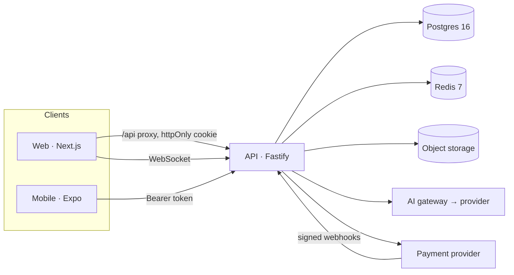

# Architecture overview

```mermaid
flowchart LR
  subgraph Clients
    W[Web · Next.js]
    M[Mobile · Expo]
  end
  W -- /api proxy, httpOnly cookie --> A
  M -- Bearer token --> A
  W -- WebSocket --> A
  A[API · Fastify] --> PG[(Postgres 16)]
  A --> R[(Redis 7)]
  A --> S[(Object storage)]
  A --> AI[AI gateway → provider]
  A --> P[Payment provider]
  P -- signed webhooks --> A
```

## Principles

- **One API, many clients.** Web, mobile and admin use the same endpoints through `@yapilapi/api-client`.
- **The server decides.** Authentication, authorization and validation run on every protected endpoint. Visibility rules live in SQL predicates (`apps/api/src/lib/visibility.ts`) that feed, profile, search and AI context all share.
- **Modules by domain.** Each file in `apps/api/src/modules/` owns one domain's routes and rules. Cross-cutting services (audit, notifications, analytics, flags) live in `apps/api/src/lib/services.ts`.
- **Adapters at the edges.** Email, storage, payments and AI providers are interfaces with development implementations, so a missing external account never blocks the rest.
- **Degrade gracefully.** Redis outages fall back to in-process rate limiting and realtime; AI failures return errors only for AI features; analytics writes never fail a request.

## Request pipeline

1. `onRequest`: resolve the session from the cookie or Bearer token.
2. `preHandler`: rate limit (per user, else per IP; Redis-backed), then route-level `requireAuth` / `requireRole`.
3. Handler: `parse(schema, input)` with shared zod schemas, business rules, database work in transactions.
4. `onSend`: security headers and `x-request-id`. `onResponse`: metrics.
   With `OTEL_EXPORTER_OTLP_ENDPOINT` set, every step above is also a span in one trace (see [observability](observability.md)).
5. Errors map to `{ error: { code, message, details, requestId } }`, with `message` and each message in `details.fields` in the reader's language (below).

### Error messages in the reader's language

Code throws errors in English (`badRequest('Add a title.')`, `` tooMany(`Wait ${n} seconds.`) ``, zod messages in schemas). The error handler in `app.ts` puts them into the reader's language on the way out (`apps/api/src/lib/error-language.ts`); `code`, `status` and the rest of `details` never change, so apps keep branching on codes.

- **Which language**: a signed-in person's `profiles.locale` (read with the session row, no extra query), else the app's `x-locale` header (the web and the phone send their current language through `packages/api-client`, so signing in, signing up and password resets are covered), else `Accept-Language`, else English. API keys and OAuth tokens go by the headers.
- **Tables**: `packages/shared/src/locales/errors/<lang>.ts` (fr, ar, es, pt, sw, yo, ha), keyed by the English message; only the API imports them (`@yapilapi/shared/error-messages`), so the web and phone bundles don't carry them. A message with no entry goes out in English.
- **Messages made from values**: a template literal is keyed by its template, a `{name}` slot for each value named after the expression (`` `Only ${left} are left.` `` → `Only {left} are left.`). At run time the English message is matched against the templates (longest fixed text first) and the translation gets the same values; a value that is itself a message in the table is translated too ("Line 3: …" around a caption file's error). Call sites stay plain English; a condition between two strings (`n === 1 ? 'Only 1 is left.' : …`) gives both messages, and numeric constants are written in (`up to ${MAX} a day` with `MAX = 5` is `up to 5 a day`).
- **Coverage**: `apps/api/test/error-messages.ts` reads every message the API can send from the source with the TypeScript compiler, like a lint rule: `new AppError(…)` and every function that builds one from its arguments (`badRequest`, `notFound('Post')` → "Post doesn't exist or isn't visible to you.", a module's own `tooMany`), `fields` in details, `{ error: { code, message } }` sent directly, zod messages in the API and `packages/shared`, zod's own default messages, and the messages of errors the API passes on (`SmsError`, `BlockedUrlError`, `VttError`). `apps/api/test/error-translations.test.ts` fails when a message has no entry in every table, when a table keeps a message the API no longer sends, when a translation's `{slots}` differ, or when the collector meets a message it can't read. So: after adding or changing an error message, add it to the seven tables.
- **Still English**: messages from Fastify itself for malformed requests (a body that isn't JSON), which the apps never send.

## Data

Postgres is the source of truth (see `packages/database/migrations/`). Counters (likes, comments, members) are denormalized and updated in the same transaction as the write. Full-text search uses generated `tsvector` columns with GIN indexes. Soft deletion (`deleted_at`) is used for user content so moderation and audit stay consistent.

## Realtime

The API keeps WebSocket connections per user. With Redis configured, events are published to one channel and every instance delivers to its own sockets, so the API scales horizontally. Events: `message.created`, `message.deleted`, `message.reaction`, `typing`, `conversation.created`, `plan.created`, `notification.created`.

## AI

`AiGateway` runs every request through: permission check → context loading (only data the requester can already see) → provider → output safety → audit log (task, scopes, status, latency; never content). Providers implement one `complete()` method. The Claude adapter uses the official SDK; the dev provider is deterministic and offline and is labelled as such in responses.

## Feature flags

`feature_flags` rows override defaults in `packages/shared/src/flags.ts`. Admins toggle them at `/admin`; every change is audited. Initial flags: LIVE, COMMERCE, AI_TRANSLATION, MEMORY, NOW, MINI_APPS, PLAY, REAL, REAL_TOGETHER.

## Observability

Structured JSON logs with request ids, Prometheus metrics at `/metrics`, and opt-in OpenTelemetry tracing (HTTP, Fastify, Postgres, Redis, outgoing fetch) with trace ids in the logs. Details, variables and a local Jaeger setup: [observability](observability.md). Load-test results and latency targets: [performance](performance.md).

See also: [decisions](decisions/), [deployment](deployment.md), [observability](observability.md), [performance](performance.md), [disaster recovery](disaster-recovery.md), [API](../api/README.md), [security](../security/README.md).
